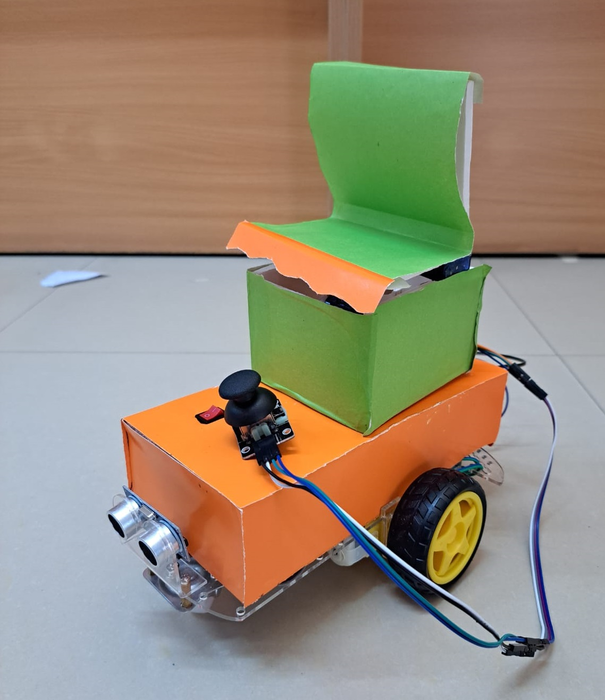

# Stand-N-Move Chair Project

## Introduction

The "Stand-N-Move Chair" is an innovative electric wheelchair designed to revolutionize the mobility experience for users with limited mobility. This project aims to empower individuals with mobility challenges, particularly those who wish to stand and control their movement using intuitive head movements. The key features of the Stand-N-Move Chair include a standing mechanism, obstacle avoidance, and control via a joystick.

## Project Goals

The Stand-N-Move Chair project aims to achieve the following objectives:

- Improve the mobility and quality of life for individuals with limited mobility.

- Ensure the safety of users through advanced obstacle avoidance technology.

- Enhance user autonomy and independence through intuitive joystick control.

- Promote social inclusion by enabling users to stand and interact with others at eye level.
- 

## Features

### 1. Standing Mechanism

The Stand-N-Move Chair features a state-of-the-art standing mechanism that allows users to transition from a seated to a standing position with ease. This feature offers several benefits:

- **Enhanced Mobility**: Users can enjoy a greater range of motion and better visibility while standing, promoting a more active lifestyle.

- **Improved Interaction**: Being able to stand brings users to eye level with others, fostering improved social interaction and participation in various activities.

- **Health Benefits**: Standing periodically can have positive effects on circulation, muscle strength, and overall well-being.

### 2. Obstacle Avoidance

The Stand-N-Move Chair is equipped with advanced obstacle avoidance technology to ensure the safety of the user. Key aspects of this feature include:

- **Sensors**: The wheelchair is equipped with sensors (such as ultrasonic sensors, cameras, and lidar) that continuously scan the surroundings for obstacles.

- **Real-time Monitoring**: The system constantly monitors the environment and provides real-time feedback to the user.

- **Intelligent Navigation**: When an obstacle is detected, the chair can autonomously navigate around it, helping the user avoid collisions.

- **User Input**: Users can also override the autonomous navigation and control the chair manually using the joystick.

### 3. Control with Joystick

The Stand-N-Move Chair is designed for intuitive control through a joystick. This control method offers several advantages:

- **Precision Control**: The joystick provides precise control over the chair's movement, allowing users to navigate in tight spaces and perform intricate maneuvers.

- **User-Friendly**: The joystick is easy to use and can be customized to accommodate different user preferences and abilities.

- **Safety**: The joystick control ensures that users have direct control over their movement, enhancing safety and independence.

## How It Works

The Stand-N-Move Chair utilizes a combination of cutting-edge technologies to deliver its features:

1. **Standing Mechanism**: The chair's frame includes a motorized standing mechanism that allows users to switch between seated and standing positions. This is controlled through a user-friendly interface.

2. **Obstacle Avoidance**: The chair's sensors collect data about the environment in real-time. When an obstacle is detected, the system's software calculates an alternative path to avoid it. The user can choose to follow this path or override it using the joystick.

3. **Joystick Control**: The joystick is connected to the chair's control unit, allowing users to move in any direction and control the chair's speed with ease.

## Final Prototype

## Future Enhancements

While the Stand-N-Move Chair already offers an impressive set of features, the project team envisions several future enhancements, including:

- Integration with mobile apps for tracking.

- Enhanced customization options for user comfort.

- Research and development of additional safety features.

- Expansion of the chair's compatibility with different environments and terrains.

## Conclusion

The "Stand-N-Move Chair" project represents a significant step forward in improving the mobility and quality of life for individuals with limited mobility. By incorporating a standing mechanism, obstacle avoidance technology, and intuitive joystick control, this innovative electric wheelchair aims to empower users and promote inclusivity. The project team is committed to ongoing research and development to further enhance the chair's capabilities and ensure it meets the diverse needs of its users.
